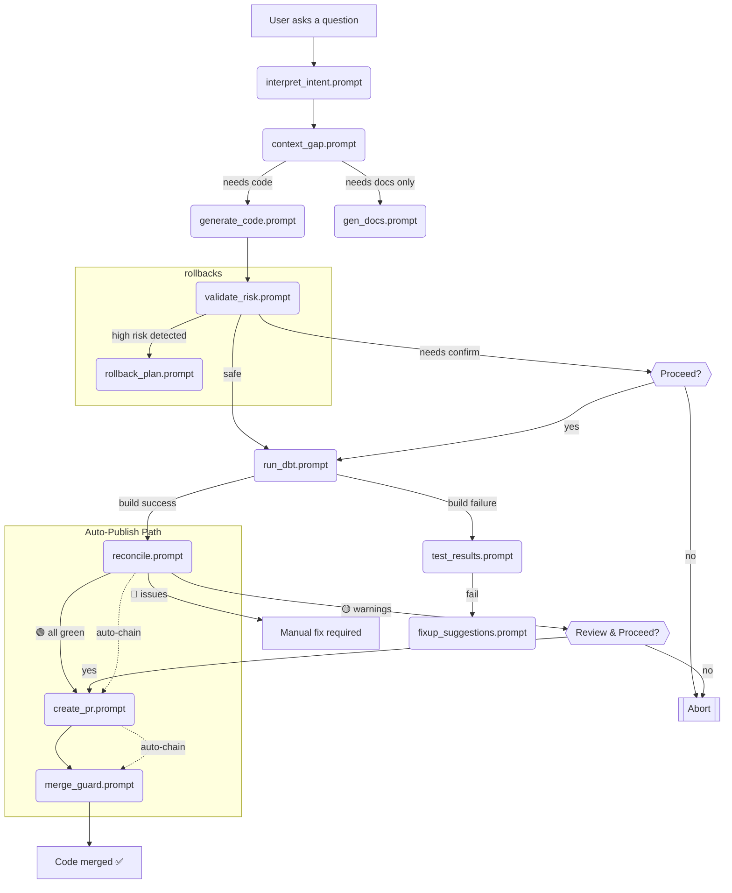

# LLM Prompts for Data Science & Engineering

A repository of LLM prompts that can be served over MCP to your LLM. Write once, prompt anywhere.

## Features

- A collection of useful LLM prompts for data science and engineering workflows
- Complete data workflow prompt pathway for analytics engineering tasks
- **Compact Markdown output format** - De-noised JSON with collapsible details sections
- **Auto-publish path** - Automated PR creation and merge workflow after successful reconciliation
- **User approval checkpoints** - Built-in confirmation steps for quality control
- Schema reconciliation features for safe data operations with 5-row risk summary tables
- **Macro style guardrails** - Enforced <300 LOC, 2-space indent, Jinja lint requirements
- LLM prompts served via MCP (Model Context Protocol)
- Easily extendable for additional LLM prompts
- Built with TypeScript and the official MCP SDK

---

## 🚀 Quick Start

### Installation

1. **Clone the repository**

   ```sh
   git clone git@github.com:markoniga/llm-prompts-for-dse.git
   cd llm-prompts-for-dse
   ```

2. **Install dependencies**
   ```sh
   yarn install
   ```

3. **Build the project**
   ```sh
   yarn build
   ```

### Setup MCP Server

Add the MCP server to Cursor (or your other MCP client) to access these prompts:

```typescript
// Add to your MCP config file (e.g., Cursor's mcp.json)
{
   "llm-prompts": {
      "command": "node",
      "args": [
        "/path/to/llm-prompts-for-dse/build/server.js"
      ]
    }
}
```

### Example Usage

Once configured, you can use these prompts in your conversations:

#### **Data Workflow Examples**
- *"Use the interpret_intent prompt to help me understand what kind of dbt model I need for customer lifetime value analysis"*
- *"Apply the generate_code prompt to create a dbt model that calculates monthly recurring revenue"*  
- *"Use the validate_risk prompt to assess the impact of adding a new column to our users table"*
- *"Apply the reconcile prompt to automatically run dbt build and reconcile with Preset"*
- *"Use the test_results prompt to help me understand why my dbt tests are failing"*
- *"Apply the create_pr prompt to generate a pull request description for this new analytics model"*

#### **Money-Movement Legacy Refactor Workflow**
- **Auto-publish path**: After successful reconciliation, automatically chains to PR creation with title: "♻️ Money-Movement Legacy Refactor – generated by MCP"
- **Macro guardrails**: Enforced <300 LOC per macro, 2-space indentation, required doc-blocks (`/** Purpose, Args, Returns, Example */`)
- **Test chain**: `getRunDbtPrompt` → `getRunTestsPrompt` → `getReconcilePrompt` → auto-PR creation
- **Style compliance**: All code validated with `dbt deps && dbt compile` before commit

---

## 📊 Data Workflow Pathway

The data workflow prompts form a complete pathway that guides data scientists and analytics engineers from initial question to deployed code:



### How to Use the Data Workflow

1. **Start with Intent Classification**: "Use the interpret_intent prompt to understand what I'm trying to achieve with customer segmentation"

2. **Fill Context Gaps**: "Apply the context_gap prompt to identify what schema information we need"

3. **Generate Code or Documentation**: "Use the generate_code prompt to create a dbt model for customer segments"

4. **Validate and Test**: "Apply the validate_risk prompt to check if this model change is safe"

5. **Create PR and Merge**: "Use the create_pr prompt to generate a pull request for this new model"

---

## 📚 Available Prompts

### Data Workflow Prompts

#### `getInterpretIntentPrompt`

- **Description:** Returns a prompt to help clarify user goals and classify data workflow intents. Use this tool to determine if a user is asking a question, requesting a code change, or needing documentation updates.
- **Returns:** The full contents of [`interpret_intent.prompt`](./src/llm-prompts/data-workflow/interpret_intent.prompt)

#### `getContextGapPrompt`

- **Description:** Returns a prompt to identify missing information needed to address a data workflow request. Use this tool to analyze context gaps and gather necessary schema information or business logic.
- **Returns:** The full contents of [`context_gap.prompt`](./src/llm-prompts/data-workflow/context_gap.prompt)

#### `getGenerateCodePrompt`

- **Description:** Returns a prompt to generate high-quality dbt code for models, macros, tests, and other artifacts. Use this tool to create SQL code that follows best practices and project standards.
- **Returns:** The full contents of [`generate_code.prompt`](./src/llm-prompts/data-workflow/generate_code.prompt)

#### `getGenDocsPrompt`

- **Description:** Returns a prompt to generate comprehensive documentation for dbt models, columns, and tests. Use this tool to create clear explanations of business logic and data lineage.
- **Returns:** The full contents of [`gen_docs.prompt`](./src/llm-prompts/data-workflow/gen_docs.prompt)

#### `getValidateRiskPrompt`

- **Description:** Returns a prompt to assess risks in proposed data operations, particularly SQL queries and dbt model changes. Use this tool to evaluate potential impacts on data integrity, performance, and cost, and perform schema reconciliation between environments.
- **Returns:** The full contents of [`validate_risk.prompt`](./src/llm-prompts/data-workflow/validate_risk.prompt)

#### `getRollbackPlanPrompt`

- **Description:** Returns a prompt to generate comprehensive rollback plans for data operations. Use this tool to create scripts and procedures to restore data to its previous state if an operation fails.
- **Returns:** The full contents of [`rollback_plan.prompt`](./src/llm-prompts/data-workflow/rollback_plan.prompt)

#### `getRunDbtPrompt`

- **Description:** Returns a prompt to help execute dbt commands safely and efficiently. Use this tool to get guidance on running models, tests, and other dbt operations in a controlled manner, including schema reconciliation execution steps.
- **Returns:** The full contents of [`run_dbt.prompt`](./src/llm-prompts/data-workflow/run_dbt.prompt)

#### `getRunTestsPrompt`

- **Description:** Returns a prompt to execute dbt build and pytest validation tests. Runs `dbt build --select {{ models }}` then `pytest tests/prompt_formatting` to ensure comprehensive validation of both data models and prompt formatting.
- **Returns:** The full contents of [`run_tests.prompt`](./src/llm-prompts/data-workflow/run_tests.prompt)

#### `getReconcilePrompt`

- **Description:** Returns a prompt to automate local dbt build and Preset reconciliation workflow. Runs `dbt build --select {{ models }}`, validates build success, executes Preset MCP reconciliation, and summarizes differences in a clear Markdown table format. Chains to auto-publish path when all systems are green.
- **Returns:** The full contents of [`reconcile.prompt`](./src/llm-prompts/data-workflow/reconcile.prompt)

#### `getTestResultsPrompt`

- **Description:** Returns a prompt to analyze and interpret dbt test results. Use this tool to understand test outcomes, prioritize fixes, make data quality decisions, and validate schema reconciliation between environments.
- **Returns:** The full contents of [`test_results.prompt`](./src/llm-prompts/data-workflow/test_results.prompt)

#### `getFixupSuggestionsPrompt`

- **Description:** Returns a prompt to generate targeted code fixes for failed dbt tests or performance problems. Use this tool to get specific, actionable code changes to resolve identified issues.
- **Returns:** The full contents of [`fixup_suggestions.prompt`](./src/llm-prompts/data-workflow/fixup_suggestions.prompt)

#### `getCreatePRPrompt`

- **Description:** Returns a prompt to generate comprehensive, well-structured pull request descriptions. Use this tool to create PR content that clearly communicates the purpose and implementation details of code changes, including schema reconciliation documentation.
- **Returns:** The full contents of [`create_pr.prompt`](./src/llm-prompts/data-workflow/create_pr.prompt)

#### `getMergeGuardPrompt`

- **Description:** Returns a prompt to ensure pull requests meet all necessary requirements before being merged. Use this tool to validate that code reviews, tests, schema reconciliation, and other quality checks have been completed.
- **Returns:** The full contents of [`merge_guard.prompt`](./src/llm-prompts/data-workflow/merge_guard.prompt)

---

## 🔄 Schema Reconciliation Features

The data workflow prompts include comprehensive schema reconciliation capabilities to ensure safe and consistent schema changes across environments:

### Schema Reconciliation Process

1. **Risk Assessment** (`validate_risk.prompt`):
   - Identifies schema changes (column additions, removals, type changes)
   - Quantifies impact on data volume and downstream dependencies
   - Classifies risk level of schema changes (high, medium, low)
   - Generates detailed schema comparison tables

2. **Execution** (`run_dbt.prompt`):
   - Provides pre-execution reconciliation steps to capture baseline schemas
   - Includes specialized commands for reconciliation mode execution
   - Offers post-execution verification queries to validate changes
   - Generates schema change summary reports

3. **Validation** (`test_results.prompt`):
   - Determines if schema reconciliation is needed based on test results
   - Performs reconciliation checks for schema comparison and data integrity
   - Analyzes downstream impact of schema changes
   - Provides reconciliation recommendations and verification steps

4. **Documentation** (`create_pr.prompt`):
   - Generates comprehensive schema reconciliation documentation for PRs
   - Creates detailed schema comparison tables showing changes
   - Includes data volume impact analysis
   - Documents downstream dependency impacts

5. **Verification** (`merge_guard.prompt`):
   - Ensures schema reconciliation is completed before approving merges
   - Verifies reconciliation documentation is complete and accurate
   - Identifies potential reconciliation blockers
   - Provides final reconciliation approval conditions

### Example Schema Comparison Table

```markdown
## 📊 SCHEMA COMPARISON: `model_name`

| Column Name | Production Type | Dev Type | Status | Impact | Rows Affected |
|-------------|-----------------|----------|---------|---------|---------------|
| user_id | INTEGER | INTEGER | ✅ MATCH | - | - |
| email | VARCHAR(255) | VARCHAR(500) | ⚠️ MODIFIED | Size increased | 0 |
| created_at | TIMESTAMP | TIMESTAMP | ✅ MATCH | - | - |
| new_column | - | VARCHAR(100) | 🆕 ADDED | New data point | All rows |
| old_column | VARCHAR(50) | - | 🗑️ REMOVED | Data loss risk | 1,234,567 |

**Summary**: 5 columns analyzed • 1 modified • 1 added • 1 removed • ⚠️ Data loss risk
```

These schema reconciliation features ensure that schema changes are properly assessed, documented, and verified throughout the development and deployment process, reducing the risk of data integrity issues and unexpected impacts on downstream dependencies.

---

## 🛠️ Development

### Local Development Workflow

#### Folder Structure

```
src/
├── llm-prompts/               # Root directory for all prompts
│   └── data-workflow/         # Data workflow prompts directory
│       ├── interpret_intent.prompt
│       ├── context_gap.prompt
│       ├── generate_code.prompt
│       ├── gen_docs.prompt
│       ├── validate_risk.prompt
│       ├── rollback_plan.prompt
│       ├── run_dbt.prompt
│       ├── test_results.prompt
│       ├── fixup_suggestions.prompt
│       ├── create_pr.prompt
│       └── merge_guard.prompt
└── mcp-server/               # MCP server implementation
    └── server.ts
```

#### Adding New Prompts

- Add a new prompt to [src/llm-prompts](./src/llm-prompts/) or create a new subdirectory for related prompts
- Register the prompt in [src/mcp-server/server.ts](./src/mcp-server/server.ts)
- Update the [mcp-prompts-manifest.json](./mcp-prompts-manifest.json) by running the refresh script

#### Updating Existing Prompts

1. Edit the prompt file in the appropriate directory
2. Run the refresh script to update the manifest file:
   ```sh
   bash scripts/refresh-mcp-prompts.sh
   ```
3. Rebuild the server to pick up the changes

#### Run the MCP server locally (with hot reload)

```sh
yarn dev
```

#### Debug with MCP Inspector

```sh
yarn build
yarn inspector
```

---

## 📖 References

- [MCP SDK Documentation](https://github.com/modelcontextprotocol/typescript-sdk)
